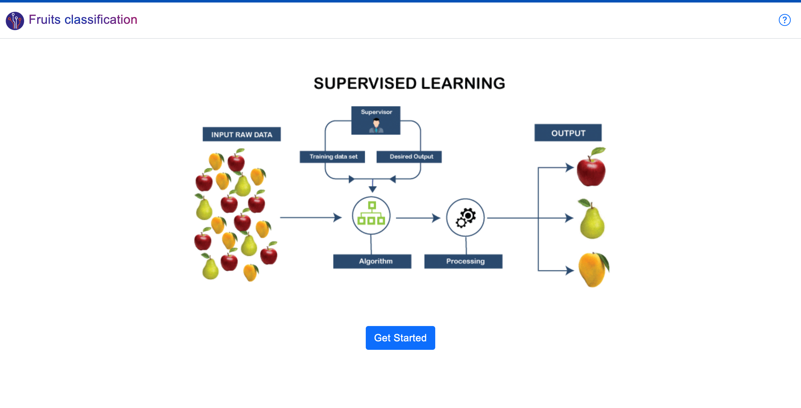
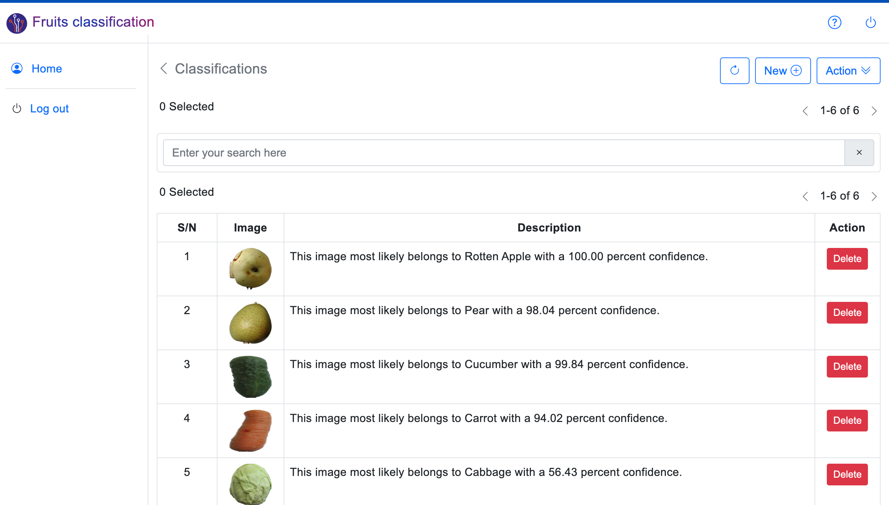
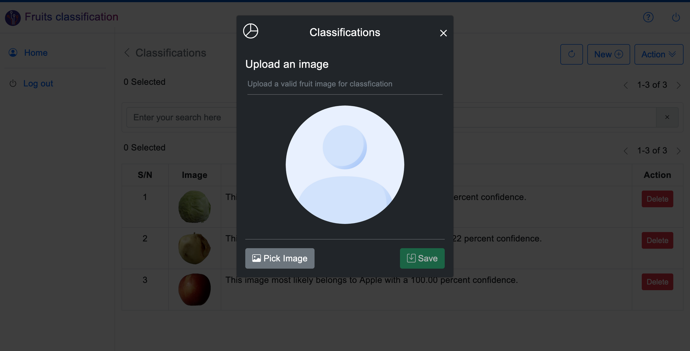
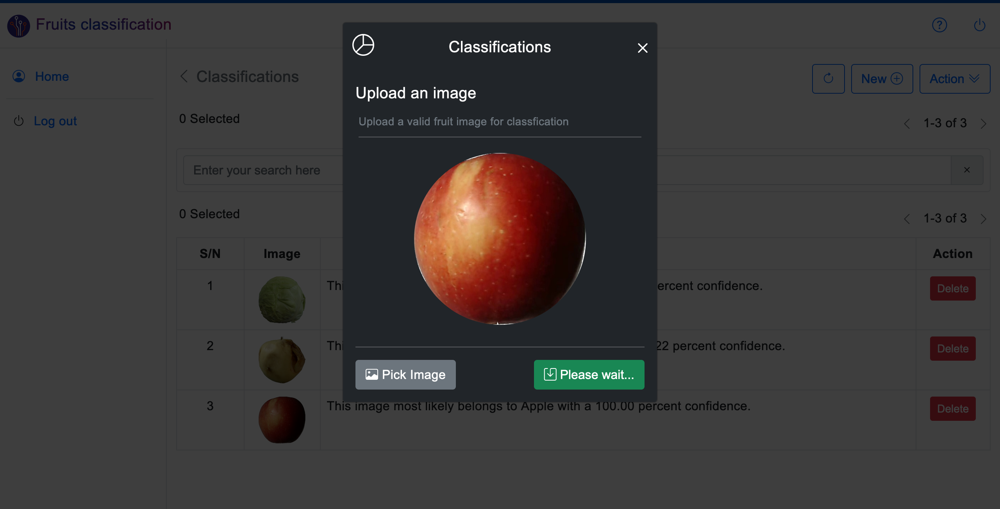

**Developer: Shuaib B. A**

**Email: instructsme@gmail.com**

## Machine Learning
## Fruits classification system using Tensorflow module, vueJs, and Django framework!

This project is a simple Fruits classificationn application which was developed with the latest technology (vueJs, Tensorflow and Django). 

**TensorFlow**
TensorFlow is a free and open-source software library for machine learning and artificial intelligence. It can be used across a range of tasks but has a particular focus on training and inference of deep neural networks. 

## Requirements
You can use **pip** command to install the following.

 1. django
 2. pandas
 3. mysqlclient
 4. tensorflow

 # Or simply use **pip install -r requirements.txt** at the root folder

## Installation

 - Create a virtual environment and install the requirements
 - Make a pull request to extract this project to your project root
 - Create MySql Database and setup a database name and password in the app settings

## To run the App
I believe you have basic knowledge of running Django app.
At your root directory, Type: Change path to the **backend**
To run, type: **python manage.py runserver**

## Database
Check the root folder

## Screenshots

**Home page**

**Users**

**Enrolment**

**Sign In**

